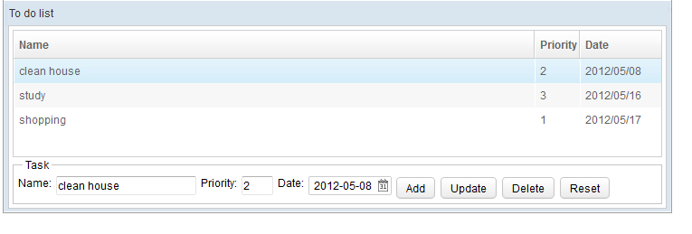

# Single Select

We'll keep using the todo list application to demonstrate the
`SelectAgent` usage. You should use this operation on a child component
including <b> *comboitem*, *tab*, *listitem*, and *treeitem* </b> to
perform **single selection**.

In this application, when selecting a *listitem*, its value will be
loaded to three different input fields for modification. The following
test case steps verifies whether or not <b>listitem</b>'s data are
correctly loaded into three input fields.



To **single** select a *listitem*, we must retrieve it first. The same
rule applies to *treeitem* and *comboitem*.

**TodoTest.java**

``` java

public class TodoTest {
    @Test
    public void test() {
        //remove irrelevant code for brevity

        //update
        desktop.queryAll("listbox > listitem").get(0).as(SelectAgent.class).select();
        //verify selected
        assertEquals("one-item",itemName.as(Textbox.class).getValue());
        assertEquals((Integer)3,priority.as(Intbox.class).getValue());
        assertEquals("2012-03-16",date.as(Datebox.class).getRawText());
    }
```

- Retrieve a *listitem* and use `SelectAgent` to select it.

# Supported Components

<table>
<thead>
<tr class="header">
<th><center>
<p>Components</p>
</center></th>
<th><center>
<p>Version</p>
</center></th>
<th><center>
<p>Note</p>
</center></th>
</tr>
</thead>
<tbody>
<tr class="odd">
<td><p>Comboitem, Tab, Listitem, Treeitem</p></td>
<td><p>5, 6</p></td>
<td></td>
</tr>
</tbody>
</table>

 
